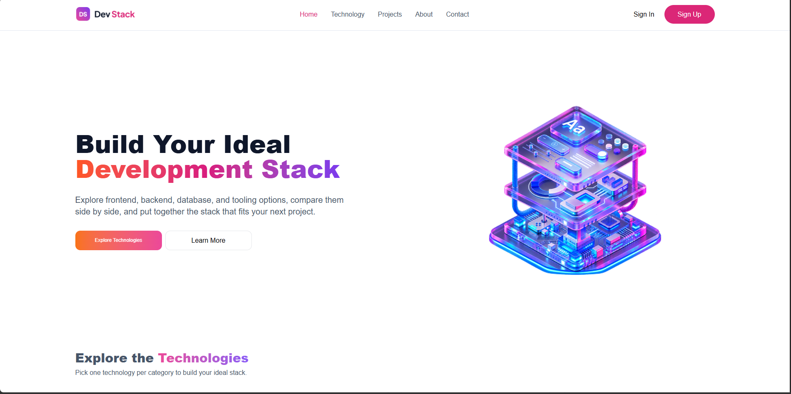

# 🚀 DevStack

### 🧩 Build Your Own Tech Stack

A responsive React application where users can explore technologies and add them to their personal tech stack.

---

## 🛠️ Technologies

- ⚛️ React.js
- 🟨 JavaScript
- 🎨 Tailwind CSS
- ⚡ Vite
- 📄 JSON
- 🔔 React Toastify

## ✨ Features

- 🔎 Explore different technologies with details.
- 🧩 Add and remove technologies from your tech stack.
- 📱 Fully responsive design for desktop, tablet, and mobile.

## 📸 Screenshot

---

# ⚛️ React Questions

### 1. What is JSX, and why is it used in React?

JSX lets us write HTML-like code inside JavaScript. It makes building React UI easier and more readable.

### 2. What is the difference between props and state?

**Props** pass data from parent to child. **State** stores and manages changing data inside a component.

### 3. What does `useState` do, and where did you use it?

`useState` manages component data that can change. I used it to manage the user's selected tech stack.

### 4. What does `useEffect` do, and why did you need it?

`useEffect` handles side effects. I used it to fetch the technology JSON data when the component loads.

### 5. Why does every `.map()` item need a unique `key`?

A unique `key` helps React identify each item and efficiently update the list.

### 6. What is conditional rendering?

Conditional rendering means showing UI based on a condition. I used it to show an empty-stack message when no technology is selected.

### 7. How do you pass data between parent and child components?

The parent passes data using **props**. A child can send data back by calling a function passed from the parent as a prop.

---

### 💻 Built with React & curiosity.

